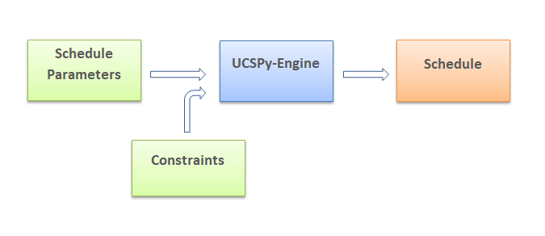
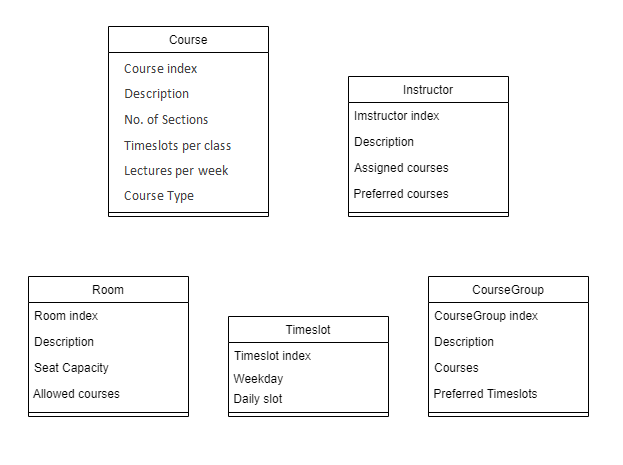
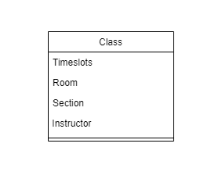
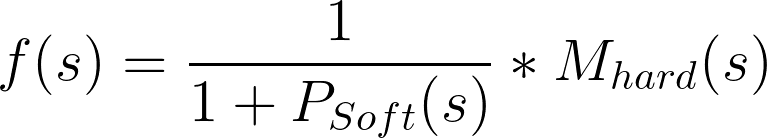

# UCSPy-Engine

An extensible framework for solving UCSP.

## What Is UCSP?

Every semester a university has to deal with the time consuming and error-prone task of scheduling courses.

The task of assigning every Section of a Course - a Classroom for a given Instructor and Timeslots is a difficult challenge on its own. The difficulty is greatly heightened with the addition of constraints like preferred rooms for a course, or preferred timeslots for an instructor, etc. The list of these (soft) constraints can be enormous for a university, making the task much more difficult.

> The task or problem of scheduling courses of a university is known as the _University Course Scheduling Problem_ or _UCSP_.

UCSP is, in fact, an NP-Complete optimization problem, meaning that figuring out the best possible schedule that satisfies all the constraints is practically impossible most of the time. That is because of the sheer number of possibilities in which a Schedule can be formed increases exponentially with the addition of a new parameter: a new room, or course, etc.

For this reason, standard searching algorithms are incapable of finding a sufficiently good solution. This is a headache for universities and educational institutions.

Fortunately, we are blessed to be living in an age with metaheuristics and other smart searching algorithms. Some examples of smart algorithms include - Genetic Algorithm, Particle Swarm Optimization, Simulated Annealing, Artificial Bee Colony Algorithm, and many others.

### What Is The Point Of UCSPy-Engine?

> The goal of UCSPy-Engine is, to democratize access to smart and easy scheduling solutions & to facilitate innovation towards finding new and improved algorithms.

It does that by doing the heavy lifting of formulating, encoding, and generating the problem into a neat application.

UCSPy-Engine should (in theory) allow any university or educational institution to plug in the parameters and constraints of their semester, and solve their scheduling problem (as long as their schedule parameters are encoded in the form accepted by the engine).

It also allows any smart individuals (like you) who like solving challenging problems - to plug in their own algorithms and achieve better or faster solutions than the algorithms currently available. This gives innovators the platform and possibility to publish their own solutions, at the same time contributing to a worthwhile and interesting problem.

---

### How It Works?

This section describes how UCSPy-Engine formulates and encodes UCSP into a set of models that can be understood by a computer. This allows us to generate, store, or manipulate schedules, as well as to measure and analyze their performance.

Our target is to find an optimal Schedule that satisfies our constraints best. But, in order to get a Schedule as output, we need to provide the necessary input.



### The Inputs

To define a UCSP, we need 2 main inputs:

- the `schedule params`: which are the required data needed to form a schedule
- and `constraints`: which are what we want to satisfy

The following represents a class diagram of the inputs- Course, Instructor, Room, Timeslot and CourseGroup:


#### Schedule Params

The `schedule params` consists of: `Courses`, `Instructors`, `Timeslots` and `Rooms`. We have one more component called `CourseGroups`, which is specific to the needs of our university i.e. IUB (and maybe to other universities as well).

A breakdown of the information/data held in each component of `schedule params` should be sufficient for working with the engine.

##### Course

Represents a particular course (of a subject) in a university e.g. CSE101 is a course.

A course consists of:

- `idx`: unique index.
- `desc`: detail description. Can contain meta-information.
- `num_of_sections`: number of sections of that course to be offered.
- `timeslots_per_lecture`: how many timeslots will be offered in a lecture. A `lecture` represents a physical event in the real world that has consecutive timeslots.
- `lectures_per_week`: how many lectures are offered in a week.
- `course_type`: Lab or Theory (more types can be used).
- `sections`: Reference to the collection of all the Sections.

##### Section

Sections are used to fulfill the total number of sections to be offered, for a particular course.

A Section consists of:

- `course`: A reference to the course.
- `sec_number`: The section number.

##### Room

Room is a location where a particular section of a course is held (e.g. CSELAB1, GPL, 5012, etc.)

A Room consists of:

- `idx`: unique index.
- `desc`: detail description. Can contain meta-information.
- `seat_capacity`: you already understand what it is.
- `allowed_course_idxs`: a collection of course indices that are allowed in this room.

##### Timeslot

A particular period/interval of time in a week.

A Timeslot consists of:

- `idx`: unique index.
- `desc`: detail description. Can contain meta-information.
- `weekday`: The day of the week (Sun-Sat).
- `daily_slot`: A workday is usually divided up into periods or slots e.g. '08:00-09:30' or 'period 1' etc. If there are 7 periods for example, then daily_slot takes a value from 0 to 6.

##### Instructor

The teacher/professor/faculty that takes a particular class.

An Instructor consists of:

- `idx`: unique index.
- `desc`: detail description. Can contain meta-information.
- `assigned_course_idxs`: the collection of courses that they are assigned.
- `preferred_timeslot_idxs`: timeslots they prefer.

##### CourseGroup

A group of courses, to no ones surprise.

A CourseGroup consists of:

- `idx`: unique index.
- `desc`: detail description. Can contain meta-information.
- `course_idxs`: a collection of Course indices.
- `preferred_timeslot_idxs`: a collection of Timeslot indices, which are preferred for the courses.

##### Class

A Class is the base unit of a schedule that defines a particular event, in space and time i.e. in room and timeslot(s).


A Class consists of:

- `section`: The Section (of a Course).
- `instructor`: The Instructor.
- `room`: The Room.
- `timeslots`: The Timeslots. Note the 's' - some courses can have classes that exceed several consecutive periods.

NOTE:

- the properties of a `schedule params` component can be modified to suit the needs of a particular university.

#### Constraints

Now let's look at the constraints.

There are 2 types: Hard and Soft. The Hard Constraints must be satisfied to consider a Schedule even viable. The Soft Constraints, when violated, add penalties to the fitness of the Schedule.

The following are the current constraints that UCSPy-Engine holds, which are mostly deduced from our university, IUB.

##### Hard Constraints

1. No two classes can take place in the same Room at the same Timeslot i.e. tuple (R, T) must be unique in a schedule.
1. No Instructor can take more than one Class at a given Timeslot i.e. tuple (I, T) must be unique in a schedule.

##### Soft Constraints

The Default penalty values for violation of a soft constraint once is shown in the square brackets.

1. [0.9] Instructors should only take certain courses they are assigned to
   (I.assigned_course_idxs)

1. [0.85] A particular Room should only allow Classes of allowed Courses
   (R.allowed_course_idxs)

1. [0.8] CourseGroups have Timeslot preferences.
   (CG.preferred_timeslot_idxs)

1. [0.6] Instructors have Timeslot preferences.
   (I.preferred_timeslot_idxs)

NOTE:
- institutions can and should adjust the penalties to their needs.

### The Output

#### Schedule

A Schedule represents a solution of the UCSP inputs provided, which consists of:

- `classes`: the collection of all classes. You might realize that the total number of classes is equal to the total number of sections, as they have a 1 to 1 mapping.
- `course_groups`: the CourseGroups. This property was optional but turned out useful for our fitness calculation of individual schedules.

### Fitness Calculation

The fitness of a schedule determines how desirable it is, and how much a Schedule violates the constraints determines its fitness.

The fitness of Schedule `s` is calculated as follows:



Where:

- `f(s)` is the fitness of `s`.
- `P_soft(s)` is the total aggregate soft constraint violation penalty.
- and `M_hard(s)` is the `hard penalty multiplier`, which is 1 if `s` does not violate any hard constraints, else 0.

Therefore, following our fitness function - a Schedule of 0 fitness is infeasible, while a fitness of 1 is a perfect solution.

---

## How To Use UCSPy-Engine?

Alright! Enough theory. It's time to see how it works!

### Dependencies

- python 3.6 (or above)
- pip

Check whether you have the correct version of python installed with:

```bash
python --version
```

### Installation

Install virtualenv:

```bash
pip install virtualenv
```

Initialize and activate a new python environment with virtualenv:

```bash
# For Linux/Unix
virtualenv -p `which python3.6` .venv
source .venv/bin/activate
```

```powershell
# For Windows
python -m virtualenv .venv
.venv\Scripts\activate
```

Install requirements using pip

```bash
pip install -r requirements.txt
```

### Usage

To solve UCSP, use the `solver` command along with the sub-command for the algo, like so:

```sh
python main.py solver <algo>
```

The available algorithms as of now are:

| solver sub-command | algorithm                   |
| ------------------ | --------------------------- |
| ga                 | Genetic Algorithm           |
| meme               | Memetic Algorithm           |
| pso                | Particle Swarm Optimization |

To use a Genetic Algorithm, for example, run:

```sh
python main.py solver ga
```

This will run the Genetic Algorithm using the default parameters, and print out the final schedule.

To save the final schedule, run:

```sh
python main.py solver --save-sch=True <algo>
```

The final schedule will be saved in `data/schedules/` as `csv`. That's because if you're reading this, you probably like `csv`, amiryt? ;)

To save the logs generated while running, use:

```sh
python main.py solver --save_logs=True <algo>
```

The logs can be used to automatically generate performance plots like this:


And it is done by using the `plot` command, which takes the path of the log file like so:

```sh
python main.py plot data/logs/<filename>
```

To plot from the sample log file, for example, run:

```sh
python main.py plot data/logs/sample.log
```

Neat right?

The demonstrations till now use the default parameters, including the default schedule_params, which are in `data/schedule_params/default/`. They are basically `csv` files containing each of the `schedule_params` components, and are named as follows: `rooms.csv`,`timeslots.csv`,`courses.csv`,`instructors.csv`,`course_groups.csv`.

To specify your own schedule_params, collect/generate the data for each component, name the files accordingly and put them in a folder like `path/to/your/schedule_params/`. To use use that now, run:

```bash
python main.py solver --params_folder=path/to/your/schedule_params/ <algo>
```

To inspect the fitness of the final schedule, use the `--inspect_final_sch` flag like so:

```bash
python main.py solver --inspect_final_sch=True <algo>
```

For help or synopsis:

```bash
python main.py -
python main.py --help

python main.py - <command>
python main.py - <command> --help

python main.py - <command> <subcommand> --help
```

**NB:**

- it is very important that your schedule_params follow the standard order and notation as shown in the default params.
- all `.csv` files are ignored by git as mentioned in the `.gitignore` patterns, except for the default schedule_params. You may update your `.gitignore` to track yours.

---

## How To Contribute To UCSPy-Engine?

UCSPy-Engine is open sourced under the MIT license. So feel free to hack, modify, or encode your own way or add new algorithms.

Contributions to UCSPy-Engine are welcome! You can make pull requests to the `master` branch.

### Adding your own algorithm

To add your own algorithm, you'll need access to these objects and functions.

- a `UCSPLogger`: [will be passed as parameter] (can be found in `core.logging` module)
  used for logging only to the console or to the log file and console. Use its `write` method for printing.

- a `StateManager`: [will be passed as parameter] (can be found in `core.models` module)
  contains all the schedule params and other utility methods.

- `generate_random_schedule`: (can be imported from `core.schedule_generators.grs`)
  function used to generate schedules that satisfy the hard constraints.

- `fitness`: (can be imported from `core.fitness`)
  function used for calculating the fitness of a Schedule.

I also suggest you to study the currently available algorithms to understand how they are implemented and integrated with the system.

To make your algorithm accessible through the cli, call it through `core.models.Solver` following the signature other algorithms are called by. It is requested that you keep your algorithms in `algorithms/<algo-name>/`.

Hope you learn from our grossly inefficient algorithms and implement some better ones. Best of luck!

## License

MIT.
