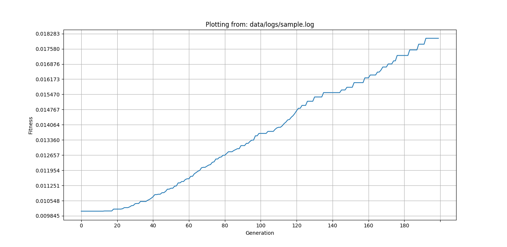

# UCSPy-Engine

An extensible framework for solving UCSP.

## What Is UCSP?

Every semester a university has to deal with the time consuming and error prone task of scheduling courses.

The task of assigning every Section of a Course - a Classroom for a given Instructor and Timeslots is a difficult challenge on its own. The difficulty is greatly heightened with the addition of constraints like: preferred rooms for a course, or preferred timeslots for an instructor etc. The list of these (soft) constraints can be enormous for a university, making the task much more difficult.

> The task or problem of scheduling courses of a university is known as the _University Course Scheduling Problem_, or _UCSP_.

UCSP is, in fact, an NP-Complete optimization problem, meaning that figuring out the best possible schedule that satisfies all the constraints is practically impossible most of the time. That is because the sheer number of possibilities in which a Schedule can be formed, increases exponentially with the addition of a new parameter: a new room, or course etc.

For this reason, standard searching algorithms are incapable of finding a suffciently good solution. This is a headache for a universities and educational institutions.

Fortnately, we are blessed to be living in an age with metaheuristics and other smart searching algorithms. Some examples of smart algorithms include - Genetic Algorithm, Particle Swarm Optimization, Simulated Annealing, Artificial Bee Colony Algorithm, and many others.

### What Is The Point Of UCSPy-Engine?

> The goal of UCSPy-Engine is, to democratize access of smart and easy scheduling solutions & to facilitate innovation towards finding new and improved algorithms.

It does that by doing the heavy lifting of formulating, encoding and generating the problem into a neat application.

UCSPy-Engine should (in theory) allow any university or educational-institution to plug in the parameters and constraints of their semester, and solve their scheduling problem (as long as their schedule_parameters are encoded in the form accepted by the engine).

It also allows any smart individuals (like you) who like solving challenging problems - to plug in their own algorithms and achieve better or faster solutions than the algorithms currently available. This gives innovators the platform and possibility to publish their own solutions, at the same time contributing to a worthwhile and interesting problem.

---

### How It Works?

This section describes how UCSPy-Engine formulates and encodes UCSP into a set of models that can be understood by a computer. This allows us to generate, store or manipulate schedules, and measure & analyze their performance.

### Models

<!--
TODO:
- Schedule params (as input)
   - the components:
- Schedule (as output)
-->

#### Course

represents a particular course (of a subject) in a university e.g. CSE101.

A course consists of the number of sections, its type (i.e. Theory and Lab) , the timeslot it is assigned in and the number of classes taken of that particular course in a week. For e.g. CSE101 is a course.

#### Section

multiple sections of a course can be offered in a semester. e.g. 5 sections of CSE101.

#### CourseGroup

it refers to the group of courses that have a set of preferred timeslots. The purpose of CourseGroup is to ensure that the classes of different levels in a university are not very scattered. For example the level 1 courses (i.e. CSE101, CSE104 etc.) should be scheduled earlier in the day.

#### Room

room is a location where a particular section of a course is held (e.g. CSELAB1, GPL, 5012, etc.)

#### Instructor

Each Instructor instance is composed of their name, index, assigned courses and preferred timeslots.

#### Class

is the base unit of a schedule which defines a particular event. It consists of: a set of timeslots, room, instructor and a particular section of a course.

#### Schedule

represents a solution of the UCSP, which consists of a collection Classes.

### Fitness

<!-- - TODO -->

#### Constraints

<!-- - TODO -->

##### Hard Constraints

1. No two classes can take place in the same room at the same Timeslot (R, T)
1. No instructor can take more than one class at a given Timeslot (I, T)

To add a new hard constraint

- write a func that takes a Schedule as param
- perform desired violation check on Schedule
- if violates, return True else return False
- add your func to the list HARD_CONSTRAINTS at the end

##### Soft Constraints

1. [0.9] Instructors should only take certain courses they are are assigned to
   (I.assigned_course_idxs)

1. [0.85] A particular Room should only allow Classes of certain Courses
   (R.allowed_course_idxs)

1. [0.8] CourseGroups have Timeslot preferences.
   (CG.preferred_timeslot_idxs)

1. [0.6] Instructors have Timeslot preferences.
   (I.preferred_timeslot_idxs)

To add a new soft constraint

- write a func that takes param: (Schedule S, float unit_penalty)
- perform desired violation check on Schedule
- count the number of times S violates your constraint
- return (n \* unit_penalty) from your func
- add your func to the list SOFT_CONSTRAINTS at the en

inputs to ucsp-engine: i.e. schedule params -> the classes/models
output: Classes form -> Schedule
constraints allow calculation of -> fitness
the algorithms

---

## How To Use UCSPy-Engine?

### Dependencies

- python 3.6 (or above)
- pip

Check whether you have the correct version of python installed with:

```bash
python --version
```

### Installation

Install virtualenv:

```bash
pip install virtualenv
```

Initialize and activate a new python environment with virtualenv:

```bash
# For Linux/Unix
virtualenv -p `which python3.6` .venv
source .venv/bin/activate
```

```powershell
# For Windows
python -m virtualenv .venv
.venv\Scripts\activate
```

Install requirements using pip

```bash
pip install -r requirements.txt
```

### Usage

To solve UCSP, use the `solver` command along with the sub-command for the algo, like so:

```sh
python main.py solver <algo>
```

The available algorithms as of now are:

| solver sub-command | algorithm                   |
| ------------------ | --------------------------- |
| ga                 | Genetic Algorithm           |
| meme               | Memetic Algorithm           |
| pso                | Particle Swarm Optimization |

To use Genetic Algorithm for example, run:

```sh
python main.py solver ga
```

This will run Genetic Algorithm using the default parameters, and print out the final schedule.

To save the final schedule, run:

```sh
python main.py solver --save-sch=True <algo>
```

The final schedule will be saved in `data/schedules/` as `csv`. That's because if you're reading this, you probably love `csv`. ;)

To save the logs generated while running, as well as the final schedule use:

```sh
python main.py solver --save_logs=True <algo>
```

The logs can be used to aumatically generate performance plots like this:



And it is done by using the `plot` command, which takes the path of the log file like so:

```sh
python main.py plot data/logs/<filename>
```

To plot from the sample log file for example, run:

```sh
python main.py plot data/logs/sample.log
```

Neat right?

<!-- TODO:
   what are schedule params
   how are they formed/made
   how do they look look as CSVs
 -->

The demonstrations till now use the default parameters, including the default schedule_params, which are in `data/schedule_params/default/`. To specify your own schedule_params, use:

```bash
python main.py solver --params_folder=path/to/your/schedule_params <algo>
```

For help or synopsis:

```bash
python main.py -
python main.py --help

python main.py - <command>
python main.py - <command> --help

python main.py - <command> <subcommand> --help
```

**NB:**

- it is very important that your schedule_params follow the standard order and notation mentioned above
- all `.csv` files are ignored by git as mentioned in the `.gitignore` patterns, except for the default schedule_params.

---

## How To Contribute To UCSPy-Engine?

UCSPy-Engine is open sourced under the MIT license.

Contributions to UCSPy-Engine are welcome! So feel free to hack, modify or encode your own way or add new algorithms. Make pull requests to the `master` branch.

<!--
TODO:
- how to a add new algorithm? what format & params should it maintain?
 -->

## License

MIT.
