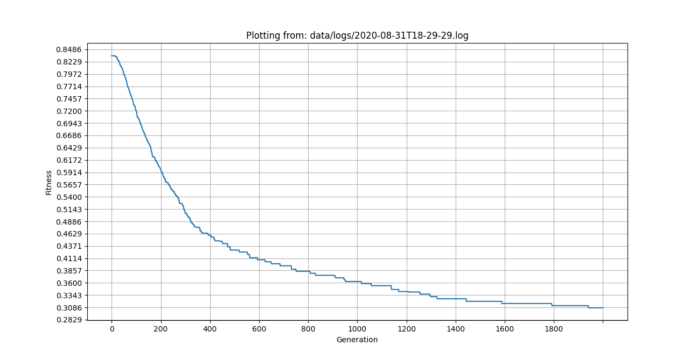

# UCSPy-Engine

 [](https://github.com/AluBhorta/UCSPy-Engine/blob/master/LICENSE)

An extensible framework for solving the University Course Scheduling Problem (UCSP).

## Related documentation

- to learn more about what is UCSP and why this framework exists, read [this](docs/about_ucsp.md).
- to learn more about the design of the system, read [this](docs/design.md).

# Getting started

## Dependencies

- python 3.6 (or above)
- pip3

Check whether you have the correct version of python and pip installed with:

```bash
python3 --version
pip3 --version
```

## Installation

Clone this repo and `cd` into the project root directory:

```bash
git clone <clone-url>
cd UCSPy-Engine
```

Initialize a new python virtual environment with venv:

```bash
python3 -m venv .venv
```

Activate the virtual environment:

```
# For Linux/Unix/Mac
source ./.venv/bin/activate

# For Windows
.venv\Scripts\activate
```

Install requirements using pip:

```bash
pip install -r requirements.txt
```

If you're using a Mac with **Apple Silicon**, run the commands below instead of the previous one:

```bash
# install and build numpy + scipy separately after openblas
brew install openblas
OPENBLAS="$(brew --prefix openblas)" pip install numpy==1.22.1 scipy==1.7.3

# install rest of the dependencies
pip install -r requirements.arm.txt
```

## Usage

There are 3 main services offered by UCSPy-Engine:

- `solve` - used to solve a course scheduling problem.
- `plot` - used to plot the performance of the solver.
- `inspect` - use to inspect the quality of the solution provided, by showing detail constraint violations.

These services require valid a json configuration file named `ucsp.config.json` to be present at the root of the project. Learn more about the configuration [here](docs/configuration.md).

### `solve`

The main use case for UCSPy-Engine is to solve a course scheduling problem.

**Running the solver through the cli**

To solve UCSP, use the `solve` command along with the sub-command for the algo, like so:

```sh
python cli.py solve <algo>
```

The available algorithms as of now are:

| solver sub-command | algorithm         |
| ------------------ | ----------------- |
| ga                 | Genetic Algorithm |
| meme               | Memetic Algorithm |

To use Genetic Algorithm, for example, run:

```sh
python cli.py solve ga
```

This will run the Genetic Algorithm using the default parameters, and print out the final schedule.

**Customizing parameters of the algorithm**

Each algorithm has a set of unique parameters that can provided as command line arguments.

For Genetic Algorithm:

| algo parameter  | description                                                                |
| --------------- | -------------------------------------------------------------------------- |
| epochs          | the maximum number of iterations before termination. (default: 100)        |
| population_size | The size of the population in a generation. (default: 100)                 |
| elite_pct       | The % of elites in the population. (default: 10)                           |
| mateable_pct    | The % of population that have a chance to perform crossover. (default: 50) |
| mutable_pct     | The % of population that could be mutated. (default: 20)                   |

For Memetic Algorithm:

| algo parameter   | description                                                                          |
| ---------------- | ------------------------------------------------------------------------------------ |
| epochs           | the maximum number of iterations before termination. (default: 100)                  |
| population_size  | The size of the population in a generation. (default: 100)                           |
| elite_pct        | The % of elites in the population. (default: 10)                                     |
| mateable_pct     | The % of population that have a chance to perform crossover. (default: 50)           |
| lcl_search_pct   | The % of population that performs local search. (default: 10)                        |
| lcl_search_iters | The number of iterations of local search for each selected individual. (default: 30) |

For example, the number of epochs could easily be changed to 500 like so:

```sh
python cli.py solve ga --epochs=500
```

<!-- TODO: keep (with proper context) or remove
The other parameter can be updated as well like so:

```sh
python cli.py solve --save_logs=True <algo>
``` -->

### `plot`

When solver is run with the `save_logs` flag set to true, it'll save the logs generated in a file under the folder `data/logs/` with the datetime as the log's name `<datetime>.log`.

These generated logs can be used to automatically generate performance plots like this:



And it is done by using the `plot` command, which takes the path of the log file like so:

```sh
python cli.py plot <filpath>
```

To plot from the sample log file, for example, run:

```sh
python cli.py plot data/logs/sample.log
```

### `inspect`

When solver is run with the `save_schedule` flag set to true, it'll save the final schedule in two forms as csv - one in numerical form (e.g. `sch-num-<datetime>.csv`), and the other in a human readable string form (e.g. `sch-str-<datetime>.csv`).

For example, to inspect the fitness of a schedule named `sch-num-2020-09-03T10-41-37.csv`, run:

```bash
python cli.py inspect data/schedules/sch-num-2020-09-03T10-41-37.csv
```

This will show the constraint violations and the final fitness.

NOTE:

- Make sure you select the correct schedule_param that was used to generate the schedule in the first place.

## Additional info

For help or synopsis:

```bash
python cli.py -
python cli.py --help

python cli.py - <command>
python cli.py - <command> --help
```

<!-- TODO: add cli docs
e.g. for -> python cli.py solve -- --help
and for others
 -->

NOTE

- it is very important that your schedule_params follow the standard order and notation as shown in the default params.
- all `.csv` files are ignored by git as mentioned in the `.gitignore` patterns, except for the default schedule_params. You may update your `.gitignore` to track yours.

## Extensibility

The system was designed to be flexible, so that you may customize it according to your needs.

<!-- TODO: (describe in detail) -->

- to add new algorithms - extend `Algorithm` abstract class
- to add new fitness function - extend `FitnessProvider` abstract class
- to modify/add new constraints - read [this](docs/modify_constraints.md)

You may also decide to change the `ScheduleGenerator` or update the shape of the `ScheduleParam` to suit your needs, but that will also require changes to other components of the system.

## Contributing To UCSPy-Engine

Contributions to UCSPy-Engine are welcome! Feel free to make pull requests to the `master` branch.

## License

MIT.
