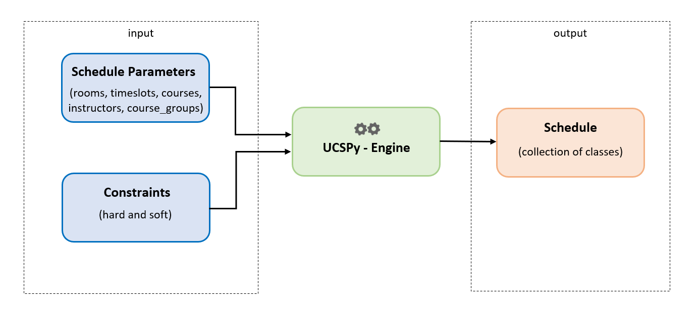

# Design

This section describes how UCSPy-Engine formulates and encodes UCSP into a set of models that can be understood by a computer. This allows us to generate, store, or manipulate schedules, as well as to measure and analyze their performance.

## How does it work?

Our target is to find an optimal Schedule that satisfies our constraints best. But, in order to get a Schedule as output, we need to provide the necessary input.

The following diagram is a visual of UCSPyEngine from a functional perspective:

## The Inputs

<!-- TODO: revise to check if all models are upto date -->

To define a UCSP, we need 2 main inputs:

- the `schedule params`: which are the required data needed to form a schedule
- and `constraints`: which are what we want to satisfy

The following represents a class diagram of the inputs- Course, Instructor, Room, Timeslot and CourseGroup:

### Schedule Params

The `schedule params` consists of: `Courses`, `Instructors`, `Timeslots` and `Rooms`. We have one more component called `CourseGroups`, which is specific to the needs of our university i.e. IUB (and maybe to other universities as well).

A breakdown of the information/data held in each component of `schedule params` should be sufficient for working with the engine.

#### Course

Represents a particular course (of a subject) in a university e.g. CSE101 is a course.

A course consists of:

- `idx`: unique index.
- `desc`: detail description. Can contain meta-information.
- `num_of_sections`: number of sections of that course to be offered.
- `lectures_per_week`: how many lectures are offered in a week. A `lecture` represents a physical event in the real world.
- `course_type`: Lab or Theory (more types can be used).
- `sections`: Reference to the collection of all the Sections.
- `credits`: The credits rewarded for taking this particular course. Currently the credits are being deduced by the `course_type` attribute, but it can be assigned explicitly to individual courses.

#### Section

Sections are used to fulfill the total number of sections to be offered, for a particular course.

A Section consists of:

- `course`: A reference to the course.
- `sec_number`: The section number.

#### Room

Room is a location where a particular section of a course is held (e.g. CSELAB1, GPL, 5012, etc.)

A Room consists of:

- `idx`: unique index.
- `desc`: detail description. Can contain meta-information.
- `seat_capacity`: you already understand what it is.
- `allowed_course_idxs`: a collection of course indices that are allowed in this room.

#### Timeslot

A particular period/interval of time in a week.

A Timeslot consists of:

- `idx`: unique index.
- `desc`: detail description. Can contain meta-information.
- `weekday`: The day of the week (Sun-Sat).
- `daily_slot`: A workday is usually divided up into periods or slots e.g. '08:00-09:30' or 'period 1' etc. If there are 7 periods for example, then daily_slot takes a value from 0 to 6.

#### Instructor

The teacher/professor/faculty that takes a particular class.

An Instructor consists of:

- `idx`: unique index.
- `desc`: detail description. Can contain meta-information.
- `assigned_course_idxs`: the collection of courses that they are assigned.
- `preferred_timeslot_idxs`: timeslots they prefer.
- `min_credit_req`: the minimum credits that should be taken by a particular instructor.

#### CourseGroup

A group of courses, to no ones surprise.

A CourseGroup consists of:

- `idx`: unique index.
- `desc`: detail description. Can contain meta-information.
- `course_idxs`: a collection of Course indices.
- `preferred_timeslot_idxs`: a collection of Timeslot indices, which are preferred for the courses.

#### Class

A Class is the base unit of a schedule that defines a particular event, in space and time i.e. in room and timeslot(s).

A Class consists of:

- `section`: The Section (of a Course).
- `instructor`: The Instructor.
- `room`: The Room.
- `timeslots`: The Timeslots. Note the 's' - some courses can have classes that exceed several consecutive periods.

NOTE:

- the properties of a `schedule params` component can be modified to suit the needs of a particular university.

### Constraints

Now let's look at the constraints.

There are 2 types: Hard and Soft. The Hard Constraints must be satisfied to consider a Schedule even viable. The Soft Constraints, when violated, add penalties to the fitness of the Schedule.

The following are the current constraints that UCSPy-Engine holds, which are mostly deduced from our university, IUB.

#### Hard Constraints

1. No two classes can take place in the same room at the same Timeslot.
2. No Instructor can take more than one class at a given Timeslot.

#### Soft Constraints

1. Instructors should only take certain courses they are are assigned to.

2. A particular Room should only allow Classes of certain Courses.

3. CourseGroups have Timeslot preferences.

4. Instructors have Timeslot preferences.

5. If a Course has 2 Lectures Per Week, it should take place in a composite Timeslot i.e. with Day code of "ST" or "MW".

6. The Lab Section of a Course (if any) should be placed in a Timeslot that is before or after the corresponding Theory Section.

7. Instructors have minimum credit load requirements.

8. The Theory Section and the corresponding Lab Section of a Course (if any) should be taken by the same Instructor.

NOTE:

- institutions can and should adjust the penalties to their needs.
- the Lab course should be directly after its corresponding Theory course in the `courses.csv` schedule_param
- read [this](./modify_constraints.md) to learn more about how to modify/add constraints.

## The Output

### Schedule

A Schedule represents a solution of the UCSP inputs provided, which consists of:

- `classes`: the collection of all classes. You might realize that the total number of classes is equal to the total number of sections, as they have a 1 to 1 mapping.
- `course_groups`: the CourseGroups. This property was optional but turned out useful for our fitness calculation of individual schedules.

## Fitness Calculation

The fitness of a schedule determines how desirable it is, and how much a Schedule violates the constraints determines its fitness.

<!-- The fitness of Schedule `s` is calculated as follows: -->

There are 3 different fitness functions currently available:

- TanH 

Where a schedule of `1.0` fitnes is infeasible, while a fitness of `0.0` is a perfect solution.

- Default 

Where a schedule of `0.0` fitness in infeasible, while a fitness of `1.0` is a perfect solution.

- Default Exponential 

Where a schedule of `0.0` fitness in infeasible, while a fitness of `1.0` is a perfect solution. 

---

<!-- TODO: specify the input knobs that can be turned, including the shape of the csv/excel files that are needed -->
