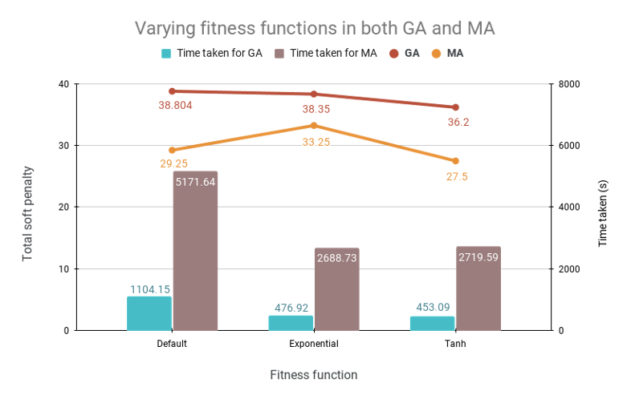
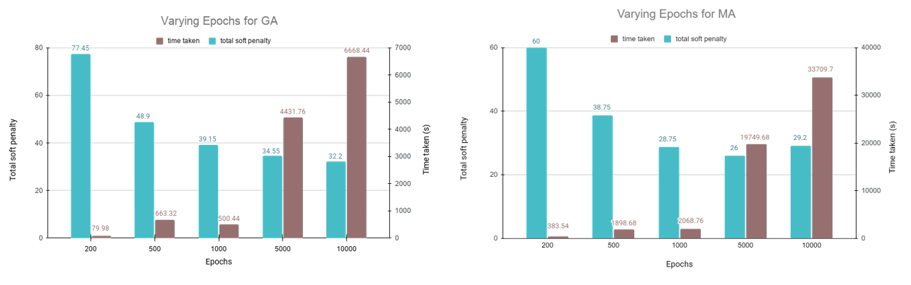
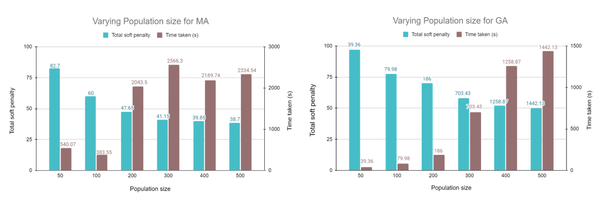

# Summary

Every semester a university has to deal with the time-consuming and error-prone task of scheduling courses, which is known as the `University Course Scheduling Problem (UCSP)`. The goal of UCSPy-Engine is to provide an extensible application to universities for solving their UCSP and to provide a research platform for facilitating the invention of new and improved optimization algorithms.

# Statement of need

The University Course Scheduling Problem is, in fact, an NP-Complete optimization problem, meaning that figuring out the best possible schedule that satisfies all given constraints is practically impossible most of the time using standard search algorithms. This is because the number of possibilities in which a schedule can be formed increases exponentially with the addition of a new parameter e.g. a new room, or course, etc.

Meta-heuristics like Evolutionary Algorithms are known to provide reasonable solutions to such optimization problems. Yet, many universities still solve this problem manually since designing a solution requires in-depth knowledge of the University structure, its constraints, and how they relate to the ideal schedule, as well as how to implement optimization algorithms for the scheduling. This limits the number of people and universities that have access to the solution or even attempt to solve the problem.

`UCSPy-Engine` aims to be an extensible framework in Python, that does the heavy lifting of formulating, encoding, and generating UCSP into a modular application, as well as to provide a programmable interface to implement new algorithms. The system comes with 2 functional metaheuristic algorithms out of the box and allows the option to choose fitness functions from existing or custom-built ones.

# Figures

Figure 1: Architecture of UCSPy-Engine

Figure 2: varying fitness functions in both Genetic (GA) and Memetic (MA) algorithms

Figure 3: varying epochs in both GA and MA by using tanh fitness

Figure 4: varying population in both GA and MA by using tanh fitness

# Acknowledgement

<!-- We would like to take this opportunity to convey our special appreciation and gratitude to Dr. Amin Ahsan Ali, our respected supervisor, for his guidelines and suggestions throughout the whole project. -->

We would like to thank Dr. Mahady Hasan for his valuable advice, feedback, and for providing us with the course offerings dataset of IUB. We would also like to thank Ms. Naureen Rehnuma for providing the course schedules of the English Department.

Last but not the least, we want to acknowledge the Artificial Intelligence and Cybernetics Lab for technical facilities and support.

# References
