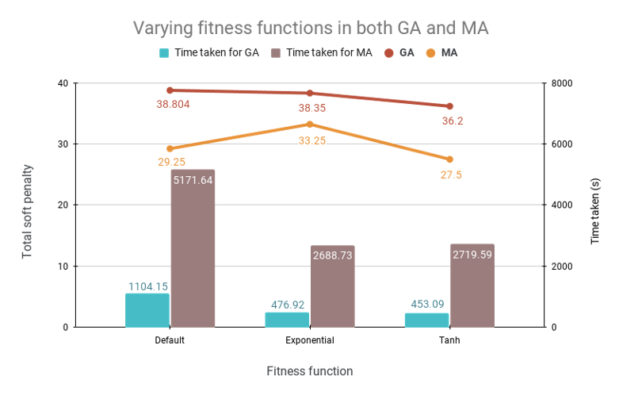
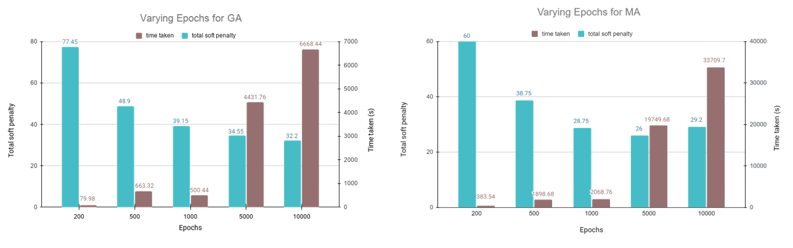
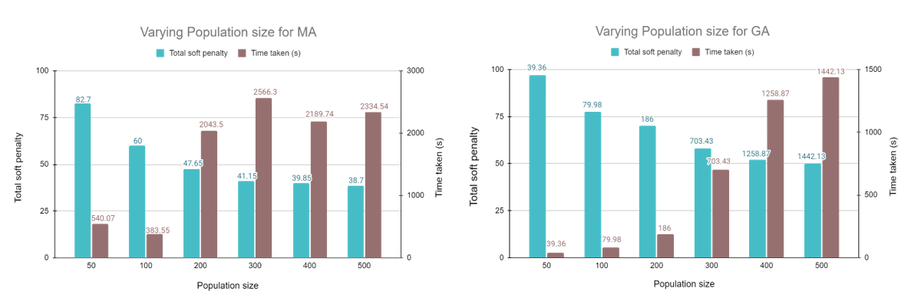

# Summary

Every semester a university has to deal with the time consuming and error-prone task of scheduling courses, which is known as the `University Course Scheduling Problem (UCSP)`. The main goal of `UCSP` is to assign every section of a course - a unique room, instructor and timeslot (3-tuple) without causing conflicts, while simultaneously satisfying a set of scheduling constraints as best as possible This task is an `NP-Complete` optimization problem and there are many different methods of tackling this scheduling problem - metaheuristic algorithms being one of the most dominant ones.
Yet, Solving UCSP for a particular institution is still a challenge - as it requires in-depth knowledge of the University structure, its constraints and how they relate to the ideal schedule, as well as how to implement metaheuristic algorithms for the scheduling. This limits the number of people and universities that have access to the solution or even attempt to solve the problem.

`UCSPy-Engine` is a customizable framework in Python, that does the heavy lifting of formulating, encoding, and generating UCSP into a modular application, as well as provides a programmable interface to implement new algorithms and encodings. The system comes with standard metaheuristic algorithms to provide solutions out of the box. It also has the option to choose from three different fitness functions to determine the fitness and the number of constraint violations in the final outcome. 

# Mathematics

# Citations

# Figures
 
Figure 1: General Structure of UCSPy-Engine

 
Figure 2: varying fitness funtions in both GA and MA

 
Figure 3: varying epochs in both GA and MA by using tanh fitness

 
Figure 4: varying Population in both GA and MA by using tanh fitness

# Acknowledgement 

# References
